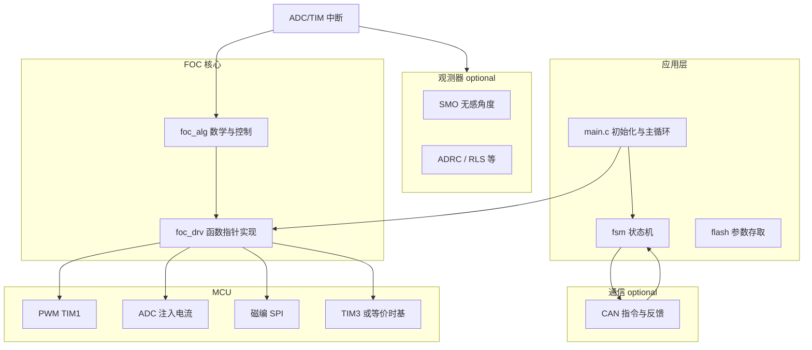

# MotorCore

[](LICENSE)

面向 STM32（当前工程为 **STM32G4**）的 **磁场定向控制（FOC）** 算法与驱动参考实现。核心控制逻辑集中在 `FOC/` 目录，通过句柄与函数指针与具体硬件解耦，便于移植到其他 MCU 或外设组合。

## 功能概览

- **坐标变换**：Clark / Park 及其逆变换；三相电流 → `Iα,Iβ` → `Id,Iq`；`Ud,Uq` → `Uα,Uβ` → 三相电压。
- **调制方式**：**SVPWM**（扇区判断、占空比计算）、**SPWM**（基于逆 Clark 的正弦 PWM 映射）。
- **时间与速度**：`Time_t` 计算控制周期 `dt`；跨 \(2\pi\) unwrap 的机械角累加 `angle_all`；原始速度、一阶低通（`LPF_t`）、滑动平均（`SMA_t`）。
- **PID**：位置式 PID；可选积分分离（`Calculate_PID_IS`）、自适应积分分离（`Calculate_PID_IS_AIS`）。句柄内预置位置/速度/dq 电流/混合环 `PID_t`。
- **校准与辨识**（需配合编码器与开环励磁）：
  - 电流零点：`update_Ioffset_block` / `update_Ioffset_nonblock`
  - 极对数：`update_pole_pairs_sensor_*`
  - 相序/转向：`update_2DIR_sensor_*`（`DIR` 为 1–6 种相线映射）
  - 电角度零点：有/无传感器多种流程
  - 磁编码器非线性 LUT（`NLLUT_encoder[128]`）及 `update_angle_NLLUT`
  - 双编减速箱圈数估计：`update_loopcount_rotor_block`（齿轮比 `GT_A/GT_B` 等）
- **开环**：电角速度/机械角速度积分、`ctrl_motor_openloop_angle_*` 等，用于校准或拖动。

算法层使用 **CMSIS-DSP**（`arm_cos_f32` / `arm_sin_f32` 等）；参考板级实现见 `FOC/foc_drv.c`（TIM1 三相 PWM、ADC 注入采样电流、SPI 磁编 **MT6835**、TIM3 测 `dt`）。

## 架构说明（概要）

| 层次     | 文件                                 | 说明                                                                                          |
| -------- | ------------------------------------ | --------------------------------------------------------------------------------------------- |
| 算法     | `FOC/foc_alg.h`, `FOC/foc_alg.c` | 与硬件无关的 FOC、滤波、PID、校准流程；核心类型为 `Motor_HandleTypeDef`。                   |
| 驱动适配 | `FOC/foc_drv.h`, `FOC/foc_drv.c` | `foc_init()` 填充 `Motor_DrvTypeDef` 函数指针与默认 `MotorConfig`/PID；可按目标板重写。 |

**`Motor_HandleTypeDef`** 聚合：

- `Motor_ConfigTypeDef`：极对数、电流/电压限幅、`Ls/Rs/Kt`、`DIR`、机械/电角度零点、减速比 `GR`、NLLUT 等。
- `Motor_DrvTypeDef`：三相 PWM、三相电流 ADC、角度读取、`Delayms`、`Update_dt`。
- `Motor_AlgTypeDef`：三相/`αβ`/`dq` 电压电流、角度与速度、扇区、各环 PID。
- `Motor_DataTypeDef`：偏置、速度滤波、原始 ADC/角度（支持 union 单点或 DMA 数组）。

---

## 工程架构解析

### 分层模型

本工程可理解为 **应用 / 通信 / 观测器 / FOC 算法 / 板级驱动 / HAL** 多条线并存；FOC 库本身只强依赖 **算法层 + `Motor_DrvTypeDef`**，其余可按产品裁剪。



### 数据流与中断分工（当前参考实现）

参考 `Core/Src/stm32g4xx_it.c` 与 `HAL_TIM_PeriodElapsedCallback`，**电流采样与矢量控制不在同一中断里完成**，移植时务必保持「采样时刻 ↔ 控制周期」一致，避免相位误差。

| 路径                                                     | 典型触发                                     | 作用                                                                                                                                                                     |
| -------------------------------------------------------- | -------------------------------------------- | ------------------------------------------------------------------------------------------------------------------------------------------------------------------------ |
| **ADC 注入完成**（`ADC1_2_IRQHandler` / JEOC）   | 与 PWM 中心/边沿对齐触发（Cube 里配置）      | 电流偏置非阻塞累加；两相采样重构第三相 `IA=-(IB+IC)`；`update_dt`；`update_Clark` / `update_Park`；可选 `update_angle_SMO`（与编码器 `update_angle` 二选一） |
| **TIM1 更新**（`HAL_TIM_PeriodElapsedCallback`） | 与 PWM 同频（工程中约**20 kHz** 量级） | 外层控制（速度环、位置环、MIT 等）；写 `Uq/Ud` 后 `update_svpwm` 输出                                                                                                |

主循环 `while(1)` 多为空或做低频任务；**实时控制在中断**。`main` 里还会启用 `__HAL_ADC_ENABLE_IT(..., ADC_IT_JEOC)` 与 `__HAL_TIM_ENABLE_IT(&htim1, TIM_IT_UPDATE)`，与上述分工对应。

### 与 `others/` 模块的关系

- **`fsm.*`**：将运行状态（运行、停止、标定等）与 CAN 命令、标定流程衔接；标定子程序常需 **暂时关闭 PWM/ADC 中断**（`main.c` 注释例程）。
- **`can_handler.*`**：接收目标力矩/速度等，刷新 `fsm_motor.state`；与 FOC 通过共享 `motor` 句柄耦合。
- **`SMO.*` / `ADRC.*` / `RLS.*`**：无感或参数辨识扩展；与 `update_angle` / `update_velocity_LPF` 存在「二选一」关系（源码注释已说明）。
- **`others/drv_DRV835X.*`**：栅极驱动器 SPI 配置，与 `foc_alg` 无直接数据耦合，属电源级初始化。
- **双磁编 / 减速箱**：`mt6835` + `mt6816`、`update_loopcount_rotor_block` 等用于输出轴角度，属于应用扩展，不是 FOC 最小集。

### 配置与运行时依赖链

- **时钟**：`SystemClock_Config` 决定 APB/AHB，进而影响 `stm32_update_dt` 里 **TIM3 计数频率**与 `DT_SCALE_FACTOR` 是否正确。
- **`foc_init`**：清零句柄、绑定指针、默认 `MotorConfig` 与 PID；**Flash 回读**在 `main` 中单独调用，用于覆盖掉电保存的参数。
- **两相电流 + 重构**：ISR 中采用 `IA = -(IB+IC)`，对应 **三电阻或双分流** 硬件；若你为三独立分流，应改为直接 `update_IaIbIc` 三路采样。

---

## 移植说明

以下假设目标为 **保留 `foc_alg`，替换板级与工程**；若只做「同系列 STM32 换引脚」，改动最小。

### 1. 最小文件集

| 必选                                 | 说明                                                      |
| ------------------------------------ | --------------------------------------------------------- |
| `FOC/foc_alg.c`, `FOC/foc_alg.h` | 算法主体                                                  |
| CMSIS-DSP                            | `arm_math.h` 及对应库                                   |
| 你的 `foc_drv.c` / `foc_drv.h`   | 实现 `Motor_DrvTypeDef`，提供 `foc_init` 或等价初始化 |

可选：`FOC/foc_drv.c` 直接改为你板子的实现文件并改名，避免与参考板冲突。

### 2. 必须实现的驱动回调（`Motor_DrvTypeDef`）

按接口语义实现即可，名称可自定，在初始化里赋给函数指针：

| 成员                                 | 含义                                     | 移植注意                                                                                                                        |
| ------------------------------------ | ---------------------------------------- | ------------------------------------------------------------------------------------------------------------------------------- |
| `Set_PWM_A/B/C`                    | 三相占空比**0~1** 写入定时器比较值 | 与 `A_PWM_Period` 等宏一致；死区、刹车在 HAL/定时器里配置                                                                     |
| `Update_Ia/Ib/Ic_raw`              | 同步时刻的 ADC 原始值                    | 注入/DMA 需与 PWM 对齐                                                                                                          |
| `Cal_Ia/Ib/Ic`                     | 减偏置后乘系数 → 安培                   | 修改 `I_ADC_CONV` 与分流电阻、放大倍数                                                                                        |
| `Update_Angle_raw` / `Cal_Angle` | 编码器原始值 →**弧度 0~2π**      | 换 AS5047、MT6816 等时只改这两层                                                                                                |
| `Delayms`                          | 毫秒延时                                 | 校准流程用；RTOS 下可用 `vTaskDelay` 封装                                                                                     |
| `Update_dt`                        | 更新 `time->dt`（秒）                  | **必须与提供时基的定时器时钟、分频一致**；参考实现用 TIM3，公式见 `foc_drv.c` 中 `TIM3_FREQ_DIV`、`DT_SCALE_FACTOR` |

### 3. `Update_dt` 与系统时钟绑定（易错点）

参考代码中：

- `dt = (uint16_t)(curr - past) * (1.0f / (TIM_APB_CLK / TIM_Prescaler))`

更换主频或 TIM3 分频后，**必须重算**倒数因子，否则速度环、PID 中所有乘 `dt` 的项全部错误。建议在 `foc_drv.c` 用宏集中定义 **TIMER_CLK_HZ**，避免魔数。

### 4. 中断与调度策略

- **单中断**：可在同一周期内顺序执行「采样 → Clark/Park → 环 → SVPWM」，逻辑简单，需保证执行时间 < 周期。
- **双中断（本仓库）**：ADC 快路径做观测/电流坐标变换，TIM1 做外环 + `update_svpwm`；移植时复制该结构或合并为一条，但需统一 **电角度更新** 与 **电流采样** 的相位关系。
- 使用 **编码器** 时：在合适频率调用 `update_angle` 或 `update_angle_NLLUT`，并与 SMO 方案互斥。

### 5. 可选依赖的处理

| 依赖                                   | 若不用                                                               |
| -------------------------------------- | -------------------------------------------------------------------- |
| `SEGGER_RTT` / `SEGGER_RTT_printf` | 在 `foc_alg.c` 中标定失败分支改为空或 `printf`；或条件编译       |
| SMO / ADRC / RLS                       | 删除 ISR 中对应调用；使用 `update_angle` + `update_velocity_LPF` |
| CAN / FSM                              | 删除或 stub；自行用串口/模拟量给定 `Uq/Ud` 或目标转速              |
| `mt6835`                             | 替换为你的 `Update_Angle_raw`/`Cal_Angle`                        |

### 6. 链接与内存

- **堆**：`update_angle_el_zero_sensor_block` 等使用 `calloc`，需足够 **Heap_Size**（见 scatter/启动文件）。
- **FPU**：G4 为单精度硬件 FPU；若目标 MCU 无 FPU，需改编译选项并评估性能。

### 7. 验证顺序建议

1. 开环：`set_svpwm` 或 `ctrl_motor_openloop_*`，确认相序与转向。
2. 电流偏置：`update_Ioffset_*`，确认静态时 `Ia/Ib/Ic` 接近零。
3. 闭环：先电流环（`Id/Iq` PI），再速度/位置；用示波器看采样点是否在开关噪声最小区域。

---

## 目录结构（与 FOC 相关）

```
FOC/
  foc_alg.h    # 数据结构与 API 声明
  foc_alg.c    # FOC 与控制算法实现
  foc_drv.h    # 板级常量与 foc_init
  foc_drv.c    # STM32 HAL 绑定示例
Core/          # STM32Cube 生成代码（main、中断等）
others/        # 扩展模块（DRV835X、CAN、SMO、ADRC、编码器驱动等）
MDK-ARM/       # Keil µVision 工程
```

## 依赖

- **STM32 HAL**（本工程为 G4 系列）。
- **CMSIS-DSP**（`arm_math.h`）。
- 调试：代码中引用 **SEGGER RTT**（`SEGGER_RTT_printf`），若不需要可改为条件编译或移除。
- 参考 `foc_drv.c`：**MT6835** SPI 磁编码器；电流为 **ADC 注入** 三相采样；PWM 为 **TIM1** 三通道。

## 使用流程（概念）

1. 定义 `Motor_HandleTypeDef motor`，调用 **`foc_init(&motor)`**（或自行 `memset` 后绑定指针与参数）。
2. 按电机与硬件填写 **`MotorConfig`**（极对数、`UMAX`/`IMAX`、`DIR`、角度零点等）。
3. 上电后做 **电流偏置校准**，再按需做 **电角度零点 / NLLUT / 极对数** 等（均在 `foc_alg` 中提供阻塞或非阻塞版本）。
4. 在固定频率的控制循环或 **PWM/ADC 同步中断** 中顺序调用典型链路，例如：`update_dt` → `update_angle` 或 `update_angle_NLLUT` → `update_IaIbIc` → Clark/Park → 电流环 PI → `update_Park_N` → `update_svpwm`（或 `update_spwm`）；速度环需 `update_velocity_LPF` 等。

具体调用顺序需与你的电流采样时刻、PWM 更新时刻一致，请参考 `Core/Src/stm32g4xx_it.c` 中与 `motor` 相关的 ISR 实现。

## 构建

使用 **Keil MDK** 打开 `MDK-ARM/x1.uvprojx`（或工程内同名项目），选择对应 STM32G4 器件与调试器后编译烧录。若仅移植算法与驱动，见上文 **[移植说明](#移植说明)**：向新工程添加源文件、CMSIS-DSP、包含路径，并实现自己的 `foc_drv`。

## 开源与许可

- **MotorCore 自研代码**（`FOC/`、`others/` 中原创部分）：[MIT License](LICENSE)
- **STM32 HAL / Cube 生成代码**（`Core/`、`Drivers/STM32G4xx_HAL_Driver/`）：遵循 ST 组件许可，见 `Drivers/STM32G4xx_HAL_Driver/LICENSE.txt`
- **CMSIS / CMSIS-DSP**：Apache-2.0，见 `Drivers/CMSIS/LICENSE.txt`
- **SEGGER RTT** 等第三方：保留各自原有许可声明，汇总见 [NOTICE](NOTICE)

## 说明

- `Motor_ConfigTypeDef.DIR` 注释为「1：正转，-1：反转」，但实现中 **`set_pwm`/`update_IaIbIc` 使用 1–6 枚举相序**，使用前请与当前硬件接线对照。
- `Calculate_Sector` 注释中提到边界情况，极限工况建议实测验证。
- `foc_alg.c` 中部分校准流程使用 **动态内存（calloc）**，需保证堆大小足够。
